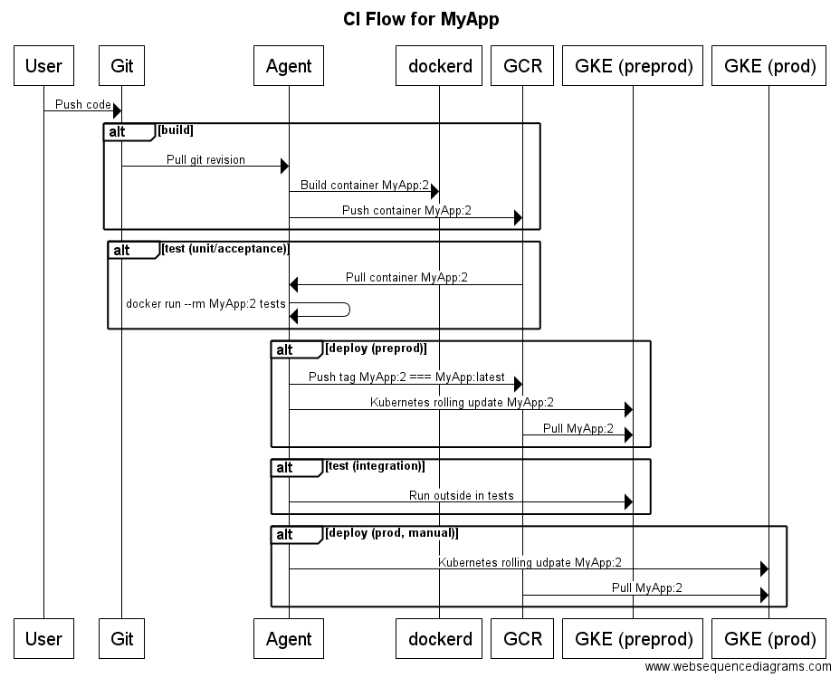

# ci-in-a-box


Welcome to __ci in a box__!  

From an empty GCP project to a EU dual-DC HA kubernetes CI/CD stack in about 6 minutes.

## What is this?
An open sourced version of the docker continuous integration and delivery setup I use on a daily basis.  When I say CI/CD, I really do mean entirely docker based.  That is the go agents, despite being docker containers themselves, build applications as containers, use Google Container Registry as an artifact store to promote them up the pipeline.

This is a rather abstract example of the CI/CD flow this stack is designed to support:



## That's wonderful, but why this repository? 
Are you one of those people that spends the first few weeks of any new engagement setting up your infrastructure (ip's, firewalls, networking), Kubernetes, then installing your CI server (in my case, GoCD)?  I am, and I was tired of it.  I want to be able to kick off a docker/kubernetes/gcp project with the least amount of effort - and that's what this project is.  I want to start working on the application as quickly as possible.

## Cool, so again, specifically, what is this?
Essentially a command line interface for automating a bunch of _low value work_.  It will:

  - Create a [GCP](https://cloud.google.com/compute/) bucket to store your terraform state in
  - Reserve three static IP's: `gocd`, `preprod` and `prod`
  - Create a named network for your stack
  - Deploy two subnetworks:
    - preprod: `10.34.96.0/24`
    - prod: `10.34.97.0/24`
  - Configure firewall rules for web apps
  - Deploy a preprod kubernetes cluster, HA'd across `eu-west1-c` and `eu-west1-d` into the preprod subnet, with a container range of `10.37.64.0/19`
  - Deploy a prod kuberneters cluster in the same way, to the prod subnet, with a container range of `10.35.96.0/19`
  - Configure `slow` and `fast` storageclasses for PersistentVolumeClaims
  - Create a separate application namespace, and config maps for each namespace 
  - Provision some persistent storage for GoCD server to persist outside of kubernetes clusters
  - Generate SSH and GPG keys for GoCD to interact with GitHub etc
  - Deploy [GoCD Master](https://github.com/Stono/gocd-master) to your preprod kubernetes cluster
  - Deploy 2x [Special GCP tweaked GoCD Agents](https://github.com/Stono/gocd-agent), preloaded with `kubectl`, `gcloud`, `terraform` etc
  - Deploy [Stono's Docker Nginx](https://github.com/Stono/docker-nginx-letsencrypt), which fronts your GoCD with a LetsEncrypt SSL certificate 
  - Automatically clean up orphaned firewall rules, disks etc, as terraform doesn't clean up pod resources if you delete a cluster
  - Make you a cup of tea.

... Just kidding about the last one, it won't make you a brew.  But with all this free time on your hands, you can totally make your own!

## Too much network jargon, paint me a picture?
Sure.


## Awesome, so what do I do?

**IMPORTANT**: At this point in time, the scripts only support Linux!  This is only short term, as I'll be moving the script into a docker container itself to add Windows and MacOSX support within the coming days! 

  1. Make sure you have a GCP account and your `gcloud` cli is logged in
  2. Clone the repo
  3. Create an `.env` file in the root of the directory
  4. Run `./start`

### An env file?
Yes, this is a completely generic implementation that is configured with the env file.  It should look like, and have all the following properties:

```
# Behaviour
NO_PROMPT="true"   # Dont prompt for confirmation of variables
NO_CONFIRM="false" # Dont prompt to continue

GCP_PROJECT_NAME="your-gcp-project-name"
STACK_NAME="testing"
STATE_BUCKET="$STACK_NAME-terraform"

# Kubernetes stuff
CLUSTER_PASSWORD="cluster-password"
NETWORK_NAME="$STACK_NAME-poc-network"

# Application Stuff
LETSENCRYPT_EMAIL="testing@test.com"
GOCD_USERNAME="user-name"
GOCD_PASSWORD="password"
GOCD_AGENT_KEY="some-super-secure-agent-key"

```

### Running `./start`
The script will validate you have all the required bits and bobs, and if you don't - prompt you what to do.  My intention is to move this entire script into its own docker container soon too, so you wont need these dependencies on your host. 

```
$ ./start 
Checking tool dependencies...
 + kubectl
 + terraform
 + gcloud
 + gsutil
 + git
 + gpg2
 + curl
 + pdata

Checking tool versions...
 + kubectl (1.5.3 >= 1.5.3)
 + terraform (0.8.7 >= 0.8.7)
 + gcloud sdk (146.0.0 >= 146.0.0)

Checking environment configuration...
 + Lets Encrypt email address (testing@test.com): 
 + This application stack name (testing): 
 + GCS Bucket to store state in (testing-terraform): 
 + GCP Private Network Name (testing-poc-network): 
 + GCP Project Name (your-gcp-project-name): 
 + The Kubernetes cluster password (testingpassword): 
 + Username to login to GOCD with (test-user): 
 + Password to login to GOCD with (password): 
 + Secure key that agents connect with (testingtesting): 

Setting cloud project...
Updated property [core/project].

 + Setup Complete!

Welcome to the all in one GCP EU Kubernetes deployment script.

Usage: start <command>
 - build      [preprod | prod | networking]  Plan and Build one of these
 - destroy    [preprod | prod | networking]  Destroy one of these
 - configure  [preprod | prod]               Configure one of these
 - deploy     [gocd-master | gocd-agents]    Deploy either the go master or agents

 - bootstrap                                 Does all of the above, on a new GCP project
 - nuke                                      Destroy everything in one devastating blow
```

If you're on a fresh setup, just run `./setup bootstrap`, wait a few minutes and then crack on building the stuff that matters.  You'll get something like this:

```
$ ./start bootstrap
Checking for cluster...
Planning the build...
Remote configuration updated
Remote state configured and pulled.
Refreshing Terraform state in-memory prior to plan...
The refreshed state will be used to calculate this plan, but
will not be persisted to local or remote state storage.

google_compute_network.network: Refreshing state... (ID: testing-poc-network)
google_compute_address.preprod: Refreshing state... (ID: testing-preprod)
google_compute_address.gocd: Refreshing state... (ID: testing-gocd)
google_compute_address.prod: Refreshing state... (ID: testing-prod)
google_compute_firewall.web-ports: Refreshing state... (ID: testing-web-ports)
google_compute_firewall.standard-ports: Refreshing state... (ID: testing-standard-ports)

+ google_compute_address.gocd
    address:   "<computed>"
    name:      "testing-gocd"
    region:    "europe-west1"
    self_link: "<computed>"

+ google_compute_address.preprod
    address:   "<computed>"
    name:      "testing-preprod"
    region:    "europe-west1"
    self_link: "<computed>"

+ google_compute_address.prod
    address:   "<computed>"
    name:      "testing-prod"
    region:    "europe-west1"
    self_link: "<computed>"

+ google_compute_firewall.standard-ports
    allow.#:                   "2"
    allow.1367131964.ports.#:  "0"
    allow.1367131964.protocol: "icmp"
    allow.803338340.ports.#:   "1"
    allow.803338340.ports.0:   "22"
    allow.803338340.protocol:  "tcp"
    name:                      "testing-standard-ports"
    network:                   "testing-poc-network"
    project:                   "<computed>"
    self_link:                 "<computed>"
    source_ranges.#:           "1"
    source_ranges.1080289494:  "0.0.0.0/0"

+ google_compute_firewall.web-ports
    allow.#:                   "1"
    allow.1250112605.ports.#:  "2"
    allow.1250112605.ports.0:  "80"
    allow.1250112605.ports.1:  "443"
    allow.1250112605.protocol: "tcp"
    name:                      "testing-web-ports"
    network:                   "testing-poc-network"
    project:                   "<computed>"
    self_link:                 "<computed>"
    source_tags.#:             "2"
    source_tags.1936433573:    "https-server"
    source_tags.988335155:     "http-server"

+ google_compute_network.network
    gateway_ipv4: "<computed>"
    name:         "testing-poc-network"
    self_link:    "<computed>"


Plan: 6 to add, 0 to change, 0 to destroy.
Applying terraform plan...
Remote configuration updated
Remote state configured and pulled.
google_compute_address.preprod: Creating...
  address:   "" => "<computed>"
  name:      "" => "testing-preprod"
  region:    "" => "europe-west1"
  self_link: "" => "<computed>"
google_compute_address.prod: Creating...
  address:   "" => "<computed>"
  name:      "" => "testing-prod"
  region:    "" => "europe-west1"
  self_link: "" => "<computed>"
google_compute_network.network: Creating...
  gateway_ipv4: "" => "<computed>"
  name:         "" => "testing-poc-network"
  self_link:    "" => "<computed>"
google_compute_address.gocd: Creating...
  address:   "" => "<computed>"
  name:      "" => "testing-gocd"
  region:    "" => "europe-west1"
  self_link: "" => "<computed>"
google_compute_address.preprod: Creation complete
google_compute_address.gocd: Creation complete
google_compute_address.prod: Creation complete
google_compute_network.network: Creation complete
google_compute_firewall.web-ports: Creating...
  allow.#:                   "" => "1"
  allow.1250112605.ports.#:  "" => "2"
  allow.1250112605.ports.0:  "" => "80"
  allow.1250112605.ports.1:  "" => "443"
  allow.1250112605.protocol: "" => "tcp"
  name:                      "" => "testing-web-ports"
  network:                   "" => "testing-poc-network"
  project:                   "" => "<computed>"
  self_link:                 "" => "<computed>"
  source_tags.#:             "" => "2"
  source_tags.1936433573:    "" => "https-server"
  source_tags.988335155:     "" => "http-server"
google_compute_firewall.standard-ports: Creating...
  allow.#:                   "" => "2"
  allow.1367131964.ports.#:  "" => "0"
  allow.1367131964.protocol: "" => "icmp"
  allow.803338340.ports.#:   "" => "1"
  allow.803338340.ports.0:   "" => "22"
  allow.803338340.protocol:  "" => "tcp"
  name:                      "" => "testing-standard-ports"
  network:                   "" => "testing-poc-network"
  project:                   "" => "<computed>"
  self_link:                 "" => "<computed>"
  source_ranges.#:           "" => "1"
  source_ranges.1080289494:  "" => "0.0.0.0/0"
google_compute_firewall.web-ports: Creation complete
google_compute_firewall.standard-ports: Creation complete

Apply complete! Resources: 6 added, 0 changed, 0 destroyed.

Planning the build...
Remote configuration updated
Remote state configured and pulled.
Get: file:///mnt/git/stono/ci-in-a-box/terraform/modules/container
Get: file:///mnt/git/stono/ci-in-a-box/terraform/modules/cluster-subnet
Refreshing Terraform state in-memory prior to plan...
The refreshed state will be used to calculate this plan, but
will not be persisted to local or remote state storage.

+ module.container.subnet.google_compute_subnetwork.subnet_europe
    gateway_address: "<computed>"
    ip_cidr_range:   "10.34.96.0/24"
    name:            "testing-preprod-eu-west"
    network:         "testing-poc-network"
    region:          "europe-west1"
    self_link:       "<computed>"

+ module.container.google_container_cluster.cluster
    additional_zones.#:                   "1"
    additional_zones.0:                   "europe-west1-d"
    cluster_ipv4_cidr:                    "10.37.64.0/19"
    endpoint:                             "<computed>"
    initial_node_count:                   "1"
    instance_group_urls.#:                "<computed>"
    logging_service:                      "<computed>"
    master_auth.#:                        "1"
    master_auth.0.client_certificate:     "<computed>"
    master_auth.0.client_key:             "<computed>"
    master_auth.0.cluster_ca_certificate: "<computed>"
    master_auth.0.password:               "testingpassword"
    master_auth.0.username:               "admin"
    monitoring_service:                   "none"
    name:                                 "testing-preprod"
    network:                              "testing-poc-network"
    node_config.#:                        "1"
    node_config.0.disk_size_gb:           "100"
    node_config.0.machine_type:           "n1-standard-2"
    node_config.0.oauth_scopes.#:         "8"
    node_config.0.oauth_scopes.0:         "https://www.googleapis.com/auth/cloud-platform"
    node_config.0.oauth_scopes.1:         "https://www.googleapis.com/auth/compute"
    node_config.0.oauth_scopes.2:         "https://www.googleapis.com/auth/devstorage.read_write"
    node_config.0.oauth_scopes.3:         "https://www.googleapis.com/auth/logging.write"
    node_config.0.oauth_scopes.4:         "https://www.googleapis.com/auth/servicecontrol"
    node_config.0.oauth_scopes.5:         "https://www.googleapis.com/auth/service.management"
    node_config.0.oauth_scopes.6:         "https://www.googleapis.com/auth/datastore"
    node_config.0.oauth_scopes.7:         "https://www.googleapis.com/auth/pubsub"
    node_version:                         "1.5.3"
    subnetwork:                           "testing-preprod-eu-west"
    zone:                                 "europe-west1-c"


Plan: 2 to add, 0 to change, 0 to destroy.
Applying terraform plan...
Remote configuration updated
Remote state configured and pulled.
module.container.subnet.google_compute_subnetwork.subnet_europe: Creating...
  gateway_address: "" => "<computed>"
  ip_cidr_range:   "" => "10.34.96.0/24"
  name:            "" => "testing-preprod-eu-west"
  network:         "" => "testing-poc-network"
  region:          "" => "europe-west1"
  self_link:       "" => "<computed>"
module.container.subnet.google_compute_subnetwork.subnet_europe: Creation complete
module.container.google_container_cluster.cluster: Creating...
  additional_zones.#:                   "" => "1"
  additional_zones.0:                   "" => "europe-west1-d"
  cluster_ipv4_cidr:                    "" => "10.37.64.0/19"
  endpoint:                             "" => "<computed>"
  initial_node_count:                   "" => "1"
  instance_group_urls.#:                "" => "<computed>"
  logging_service:                      "" => "<computed>"
  master_auth.#:                        "" => "1"
  master_auth.0.client_certificate:     "" => "<computed>"
  master_auth.0.client_key:             "" => "<computed>"
  master_auth.0.cluster_ca_certificate: "" => "<computed>"
  master_auth.0.password:               "" => "testingpassword"
  master_auth.0.username:               "" => "admin"
  monitoring_service:                   "" => "none"
  name:                                 "" => "testing-preprod"
  network:                              "" => "testing-poc-network"
  node_config.#:                        "" => "1"
  node_config.0.disk_size_gb:           "" => "100"
  node_config.0.machine_type:           "" => "n1-standard-2"
  node_config.0.oauth_scopes.#:         "" => "8"
  node_config.0.oauth_scopes.0:         "" => "https://www.googleapis.com/auth/cloud-platform"
  node_config.0.oauth_scopes.1:         "" => "https://www.googleapis.com/auth/compute"
  node_config.0.oauth_scopes.2:         "" => "https://www.googleapis.com/auth/devstorage.read_write"
  node_config.0.oauth_scopes.3:         "" => "https://www.googleapis.com/auth/logging.write"
  node_config.0.oauth_scopes.4:         "" => "https://www.googleapis.com/auth/servicecontrol"
  node_config.0.oauth_scopes.5:         "" => "https://www.googleapis.com/auth/service.management"
  node_config.0.oauth_scopes.6:         "" => "https://www.googleapis.com/auth/datastore"
  node_config.0.oauth_scopes.7:         "" => "https://www.googleapis.com/auth/pubsub"
  node_version:                         "" => "1.5.3"
  subnetwork:                           "" => "testing-preprod-eu-west"
  zone:                                 "" => "europe-west1-c"
module.container.google_container_cluster.cluster: Creation complete

Apply complete! Resources: 2 added, 0 changed, 0 destroyed.

Configuring env...
Acquiring credentials for cluster testing-preprod
Fetching cluster endpoint and auth data.
kubeconfig entry generated for testing-preprod.
Applying common configuration: /mnt/git/stono/ci-in-a-box/configuration/common/default.configmap.yml
 [i] Overriding namespace to: default
 -> kubectl --namespace default apply -f ../tmp/default.configmap.yml
 <- configmap "namespace-config" created
Deployment complete
Applying common configuration: /mnt/git/stono/ci-in-a-box/configuration/common/gce.storageclass.fast.yml
 -> kubectl --namespace default apply -f ../tmp/gce.storageclass.fast.yml
 <- storageclass "fast" created
Deployment complete
Applying common configuration: /mnt/git/stono/ci-in-a-box/configuration/common/application.namespace.yml
 -> kubectl --namespace default apply -f ../tmp/application.namespace.yml
 <- namespace "testing" created
Deployment complete
Applying common configuration: /mnt/git/stono/ci-in-a-box/configuration/common/gce.storageclass.slow.yml
 -> kubectl --namespace default apply -f ../tmp/gce.storageclass.slow.yml
 <- storageclass "slow" created
Deployment complete
Applying environment configuration: /mnt/git/stono/ci-in-a-box/configuration/preprod/namespace.configmap.yml
 [i] Overriding namespace to: testing
 -> kubectl --namespace testing apply -f ../tmp/namespace.configmap.yml
 <- configmap "namespace-config" created
Deployment complete
Acquiring credentials for cluster testing-preprod
Fetching cluster endpoint and auth data.
kubeconfig entry generated for testing-preprod.
Deploying gocd secrets...
secret "gocd.users" created
secret "gocd.goagent-key" created
secret "gocd.ssh" created

Ensuring disks...
 + testing-gocd-master
 + testing-gocd-master-config

Deploying gocd master...
 -> kubectl --namespace default apply -f ../tmp/master.pod.yml
 <- deployment "gocd-master" created
Deployment complete

Deploying gocd master service...
 -> kubectl --namespace default apply -f ../tmp/master.service.yml
 <- service "gocd-master" created
Deployment complete

Deploying gocd NGINX...
 -> kubectl --namespace default apply -f ../tmp/nginx.pod.yml
 <- deployment "gocd-nginx" created
Deployment complete

Deploying gocd NGINX service with static ip: 146.148.27.251...
 -> kubectl --namespace default apply -f ../tmp/nginx.service.yml
 <- service "gocd-nginx" created
Deployment complete

Waiting for https://146.148.27.251/go to be available........
GoCD is online at: https://146.148.27.251/go!
Acquiring credentials for cluster testing-preprod
Fetching cluster endpoint and auth data.
kubeconfig entry generated for testing-preprod.
Ensuring GPG key...
agent.asc already exists
secret "goagent.gpg-key" created

Deploying gocd preprod agents...
 [i] Overriding namespace to: default
 -> kubectl --namespace default apply -f ../tmp/agent.pod.yml
 <- deployment "gocd-agent-preprod" created
Deployment complete

Deploying gocd prod agents...
 [i] Overriding namespace to: default
 -> kubectl --namespace default apply -f ../tmp/agent.pod.yml
 <- deployment "gocd-agent-prod" created
Deployment complete

GoCD agents deployed!

Bootstrap complete, have fun on GoCD at https://146.148.27.251/go
```

#### SSH & GPG Keys
As mentioned, SSH and GPG keys are generated for the agents to git clone, git-crypt etc.  You will find them in `.tmp/.ssh` and `.tmp/.gnupg`

### LICENSE
Apache-2.0.  In summary, use it however you like but don't blame me if you break stuff!

### Special Thanks
A few people have shared the rather painful journey of discovery of the past few months when it comes to GCP, Kubernetes, GKE etc.

  - [Ana](https://github.com/orgs/peopledata/people/aninhalacerda)
  - [Fernando](https://github.com/orgs/peopledata/people/fernando-alves)
  - [Boni](https://github.com/orgs/peopledata/people/Bonifacio2)
